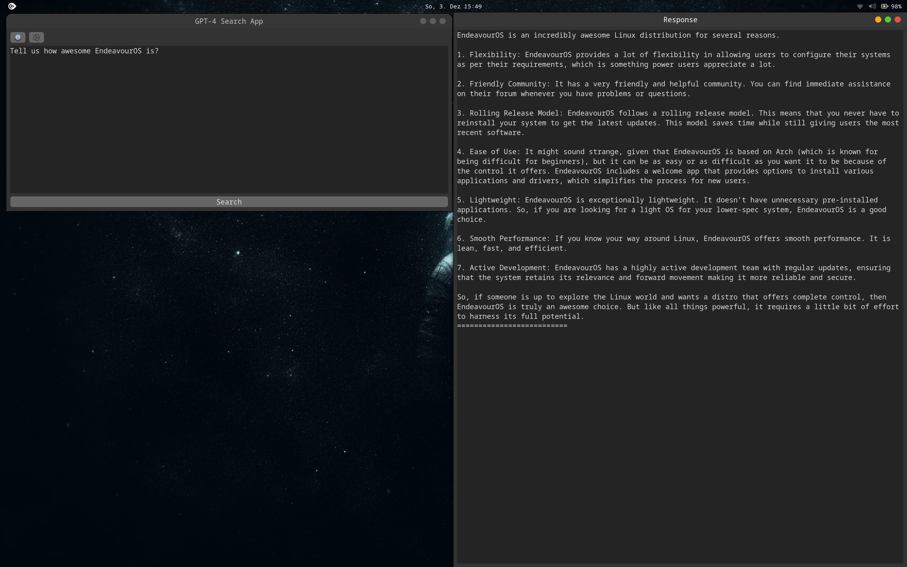

# GPT For Linux

Welcome to the GitHub repository of the GPT-4 Search App for Linux, a powerfully integrated natural language processing utility that allows you to interact with OpenAI's GPT-4 models directly from your Linux desktop!

GPT-4 Search App is written in Python and uses GTK for creating efficient and functional graphical user interfaces. This application embeds GPT API, giving you the ability to use the pre-trained GPT models in a user-friendly Linux app.



## Table of Contents
- [Features](#features)
- [Prerequisites](#prerequisites)
- [How to install](#how-to-install)
- [How to use](#how-to-use)
- [Contribution guidelines](#contribution-guidelines)
- [License](#license)
- [Acknowledgment](#acknowledgment)

## Features
- Perform GPT-4 tasks without switching to a web-based platform.
- Personalize your experience with custom temperature and frequency penalty settings.
- Securely manage your GPT-4 API key via the Settings dialog. The key is stored securely using secretstorage.
- Change the GPT Model from the Model Settings menu.

## Prerequisites
The application requires the following dependencies:
- Linux OS (If you want to use install script, your system must be able to use `pacman`)
- Python 3.x
- Python's 'gi' and 'secretstorage' libraries
- GTK 4.x
- python-requests

## How to install
Use the install script included in the repository for a swift installation.

First, download the `install.sh` file to your computer
Make the script executable:
```bash
chmod +x install.sh
```
Execute the script:
```bash
./install.sh
```

This script will check for dependencies (and install them if your system uses `pacman`), create the required directories, download the needed scripts and make them executable, and finally, create a `.desktop` file for easy application launch.

## How to use
Once installed, you can run GPT-4 Search App from your Linux application menu. 

Before using it, you need to add your GPT-4 API Key. Open the settings dialog by clicking on the key icon and enter your API key.

You can also adjust the model settings (Model type, Temperature, Frequency Penalty) by clicking on the gear icon. 

Once everything is set, you can type your query into the text box and hit the 'Search' button to send it to the GPT API. The response from the GPT API will be shown in a separate window.

## Contribution guidelines
Contributions to GPT-4 Search App are very much welcome! Please follow these steps:
- Fork this repository.
- Create your feature branch from the master branch (`git checkout -b feature/fooBar`)
- Commit your changes (`git commit -am 'Add some fooBar'`)
- Push to the branch (`git push origin feature/fooBar`)
- Create a new Pull Request

## License
This project is licensed under the GPL-3 or later License. See [LICENSE](https://github.com/TukuToi/gpt4-search-app/blob/main/LICENSE) for more information.

## Acknowledgment
We express our gratitude to the OpenAI team for their continuous effort in developing and improving language models like GPT-4 that enable projects like this one.
Even a paid team deserves some kudos.

This project is in no way associated with OpenAI.

---

Please feel free to report any issues or feature requests you may have and pull requests are very much welcome. Enjoy using GPT-4 Search App!
